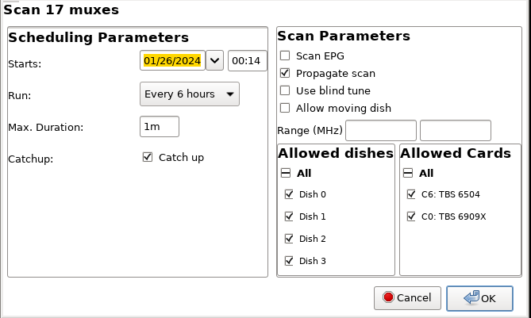

# neumoDVB #

## Automating scanning ##

neumoDVB makes it convenient to perform scans automatically and periodically. This is useful to scan all or some
muxes or all or some satellites for new EPG data or for new services. In fact these automated scans can perform
spectrum acquisition, blind scanning, and regular scanning. The only requirement is that neumoDVB needs to
left running.

In a future version, neumoDVB will also be able to run as a background process, which will allow
it to run even without being logged in. If your PC allows to power itself up from its CMOS clock, then it will
even be possible to have it start your PC, run a scan at night, and turn itself off again. However, this is
not implemented yet.

Creating a command is similar to scanning muxes or satellite bands: select all the desired muxes or satellite bands,
and instead of `Scan` or `Ctrl-S` use the command `Create Scan Command` from the menu or press `Alt-S`. For instance,
when performing this action with some muxes selected in the mux list, the following dialog appears:

On the right panel scan options can be set (see other sections of this documentation).
On the left, it is possible to specify when the command should be run:

* `Starts` The first time the scan should be run. This time can be the past. In that case the command
  will or will not be run, depending on other options below;
* `Run` When to run the command:
  * `Never` This setting is useful to temporarily disable commands;
  * `Once` This setting is useful to run a command once in the future, if you expect something interesting
    to happen, like a solar outage;
  * `Every X hours'
  * `Daily'
  * `Weekly'
  * `BiWeekly'
  * `Monthly'

* `Max duration` The command will be automatically stopped if it runs longer than this amount of time.
* `Catch up` In case the command could not be started because neumDVB was not running, it will be run
  immediately at startup if the last scheduled time was missed if `catch up` is checked.

## The commands list ##

The command list shows all currently defined commands:

It shows various pieces of information about these commands, including the muxes or satellites it
is supposed to scan and the status of the last execution. In cae you wish to edit the list
of muxes or satellites the command will scan, select `Edit command mode` from the `Edit Menu`.
A confirmation dialog will appear:

After clicking `OK`, the selected muxes and satellites will be highlighted on the satellite and
mux lists.  `command add sat` and `command add mux` from the menu or pressing `Ctrl-M` toggles individual
entries, thus adding or removing them. Unchecking the `edit command` check box in the `edit` menu ends this
process.
