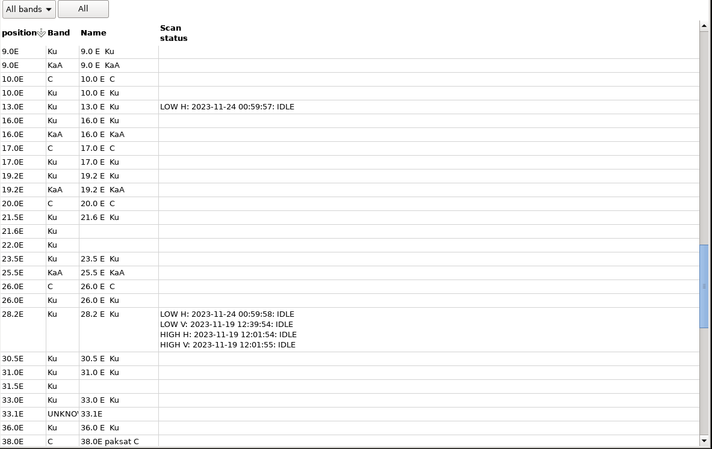

# neumoDVB #

## Scanning satellite bands ##

### Entering a new satellite ###

neumoDVB comes with a list of predefined satellites, currently only for the European region.
It is east to add  satellites yourself, which allows you to then scan them.
Use `Lists - Satellites` to enter the satellite list screen and `CTRL-N` to add a new line.

The screenshot below shows a satellite list after some scanning.
The fields heave the following meaning

* `Position` **Editable** The official satellite position. This is not the same as the `usals_Pos` setting
  in the LNBs
* `Band` **Editable** The frequency band associated with this satellite. Some positions offer multiple frequency
  band (e.g., Ku and C) and those need separate entries. The reason for this is to make it easier to restrict
  various lists to satellites bands receivable with specific LNBs.
* `Scan status`: Shows when this satellite band was last scanned and/or of it is currently being scanned
  or whether a scan is pending. This entry can have multiple lines. For instance the Ku-band has two
  sub-bands (`LOW` and `HIGH`) each having two possible polarizations (`H` and `V``). This leads to
  4 entries in the table

### Scanning one or more satellites and satellite bands ###

To scan ome or more satellites, first select them in the above list and then use the menu entry
`Control - Scan` (`Ctrl-S`). This brings up a dialog window in which various options can be selected.
By default the scan will be a `spectrum scan`, meaning that neumoDVB will acquire a spectrum, find peaks
in the spectrum and then blindscan those peaks. It does so in a clever way, using any mux data in the database
to improve the initial defaults for the scan.

The options heave the following meaning

* `Scan EPG` Perform a thorough EPG scan on each mux. This will slow down the scan and is usually not needed
  for DX-ing.
* `Propagate scan` This is disabled for now.
* `Use blind tune` This is disabled for now, because blind tune must be used when scanning peaks not backed
  by any database information. You can always use `Scan Muxes` in this case (see below).
* `Allow moving dish`: When checked, tuning is allowed to move the rotor, otherwise it is not allowed.
* `Save spectra`: When checked, the acquired spectra will be saved to disk and can be viewed using the spectrum dialog

The remaining options define a set of criteria which must all be fulfilled during scanning:

* `Range`: When values are entered here, then only this frequency range will be scanned. This is useful if you only
  wish to scan a small part of the spectrum of one or more satellites.
* `Allowed Bands`: This can be used to restrict the scan to only C-band, only Ku-Band ... In principle this is not
  needed because the same effect could be achieved by carefully selecting or not selecting rows in the satellite list.
  However, suppose you wish to scan all C-band satellites, then it is much easier to select all satellites and only
  select `C` here, as this requires fewer mouse clicks.
* `Scan polarisations`: Restrict the scan to only these polarizations.
* `Allowed dishes`: Restrict the scan to only these dishes. This is handy in case you know that some muxes
  can only be received on a specific (large) dish. In that case allowing also a smaller dish could lead
  to muxes not being scanned
* `Allowed cards`: Restrict the scan to only these cards. This is handy if you have multiple cards
  in your PC and would like to prevent some from being used.

The alternative is to select `Scan muxes` on top instead of `Scan spectrum`. In this case, neumoDVB will
use database information to re-scan already discovered muxes. Some options will be disabled because they
make no sense. Others will now be editable.

In general, neumoDVB will try to use all LNBs and cards in the system, and all LNBS on all your dishes.
NeumoDVB is aware of the limitations of cards (e..g., not being able to receive multi-streams)
and it also knows which LNBs can receive the required mux and will not try combinations which
are impossible, or which are prohibited by the above options. It will also not disturb any existing
subscription (i.e, services that are playing, or being recorded, or other scans).

After pressing `OK`, the actual scan will start. If allowed, newly discovered muxes will be
added to the scan queue, thus allowing a full or almost full satellite scan even when blindscan is not
available. When blindscan is enabled, neumodVB will still use  the tuning parameters of the mux as
known in its database and/or as retrieved from the NIT table.
This makes it more likely that the mux will be locked successfully.
