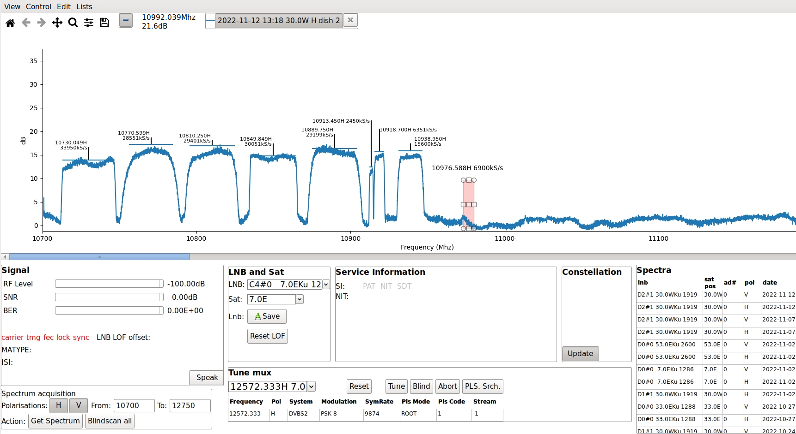

##Spectrum scan##

Spectra are always scanned using a specific LNB. Make sure tat this LNB is not in use
for any other purpose, switch to the LNB list using `Lists - LNBs`, select one of the LNBs
and press `Ctrl-E` to show the spectrum scan screen.

Spectrum scan only works if you have installed the Neumo blindscan drivers, and even then only on supported
cards. You start by scanning a spectrum, which will then display a graph on the top part of the screen.
Afterwards you can blind scan some or all of the found spectral speaks. Spectra are automatically
remembered, which allows you to find changes.

The screenshot below shows an example of what you get after scanning 4.8 East. This is a very
complex screen, so the text below  explains the various steps involved in spectrum acquisition and
blind scan and provides some details on the related parts of the screen

###Starting a spectrum scan###
Proceed as follows

* At the very bottom left on the screen, first select the bands and polarizations you want to scan.
 The default is to scan all, which will take about a minute
* Then press the `spectrum scan` button.

Spectrum scan is performed one band/polarization at a time. The result will be displayed as a graph
on the top half of the screen. To prevent a complete mess, the graph - which, for a universal LNB, covers the
range 10.7-12.75 Ghz - is zoomed horizontally by default. Above the graph (top left) some command buttons
are available to zoom and pan in the graph. These are from the `matplotlib` library and some of them may operate
a bit awkwardly. From left to right

* The `home` icon will reset the graph to what it was at the start.
* The two `arrow` buttons allow you to undo and redo zoom/pan operations made using the other buttons.
* The `cross` button: while depressed, allows to pan vertically as well as horizontallyby clicking the left mouse
  button and then dragging the cursor. Horizontal
  panning is (unfortunately) not coupled with the horizontal scroll bar below and can produce confusing results.
  Vertical panning is useful when some information is not on the screen. Neumo tries its best to provide a
  good default layout, but does not always succeed.

  By clicking the right mouse button instead of the left one, and then dragging the cursor, you can also adjust
  the vertical and horizontal zoom factor.

  **Important** This pan mode remains in effect until you deselect the cross icon (by clicking on it)

* The `loop` icon provides another way of zooming, by selecting a rectangle. Again: do not forget to deactivate it
  after use.
* The `equalizer` button is of little use and will be removed at some point
* The `floppy` icon allows saving the currently displayed part of the plot as a picture.

To the right of these `matlplotlib` buttons are other buttons:

* The `minus` button turns on or off baseline removal. If you LNB is connected with a long cable, then signal
  drop a lot towards the end of the frequency bands. They are lowest just below 11.7 Ghz and near 12.7GHz.
  Base line removal subtracts this trend and allows a better view on the spectrum
* The other buttons allow  you to turn on/off textual annotations on the displayed graphs, or to remove the
  displayed graphs, by clicking in the `X`.

At the bottom right of the screen, your will see a list under the heading `Show/Hide` spectra. This list
contains the spectra you captured earlier and will of course initially be empty. Pressing `Ctrl-Enter` on any
of the spectra, will add it as an additional graph in the plot, or remove it if it was already there.

So what exactly is in these plots? Internally in the drivers, an algorithm detects peaks in the spectrum,
and estimates their center frequencies and bandwidths. From the bandwidths, neumoDVB estimates the symbol rate
of the corresponding mux. This information is shown using vertical and horizontal lines. For narrow band transponders,
these annotations could quickly become a confusing and overlapping mess. neumoDVB tries to prevent this
by shifting text up as needed. Sometimes this may lead to to the text being above the visible part of the plot.
Use the panning facilities in this case.

###Blind scanning muxes###

After a spectrum has been acquired, press the `Blindscan All` button at the bottom to start a "spectrum blindscan".
neumoDVB will attempt to tune each of the found spectral peaks one after the other and try to lock a signal.

The whole process is similar to the manual approach that we describe below, except that neumoDVB automatically
starts scanning the next peak after the current one is finished, In manual mode, You will need to manually
start scanning the next peak.

Scanning in manual mode works as follows:

* First select any of the peaks in the graph by clicking on the text or on the horizontal or vertical
  lines. The selected peak will turn blue (that is to say: its text will turn blue). It is *not* possible
  to select peaks which were not detected by the drivers, but you can still scan such peaks using text entry
  (see below).

* Enable blindscan by depressing the  `Blind` button which tells neumo
  that it should ask the drivers for a blindscan, i.e., it should take the tuning parameters as a starting
  point only and find the correct values itself. This should really be activated by default but it is not.

* Press 'Tune` to start the blindscan process.
