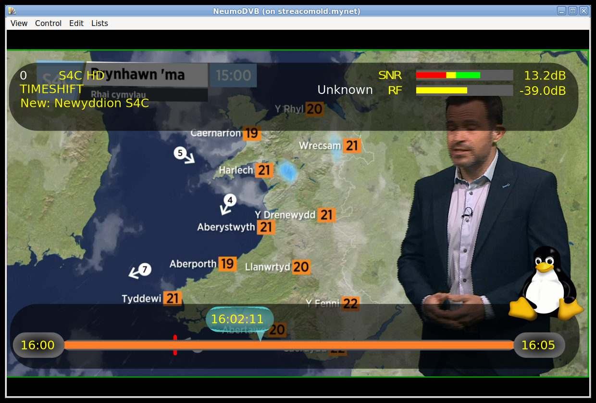
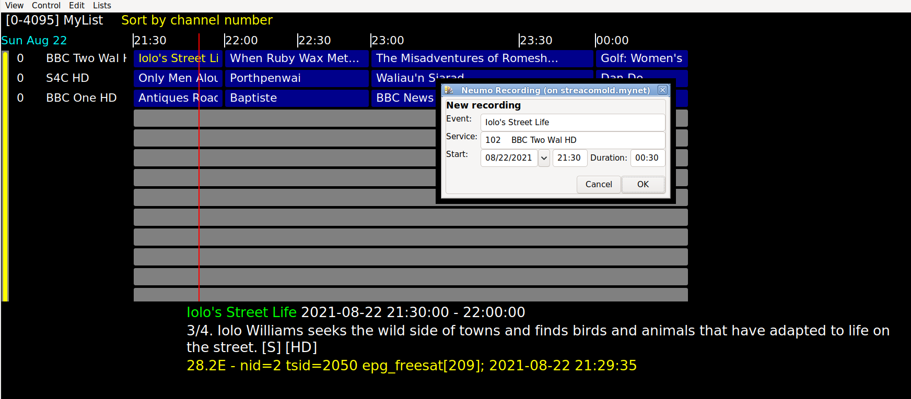
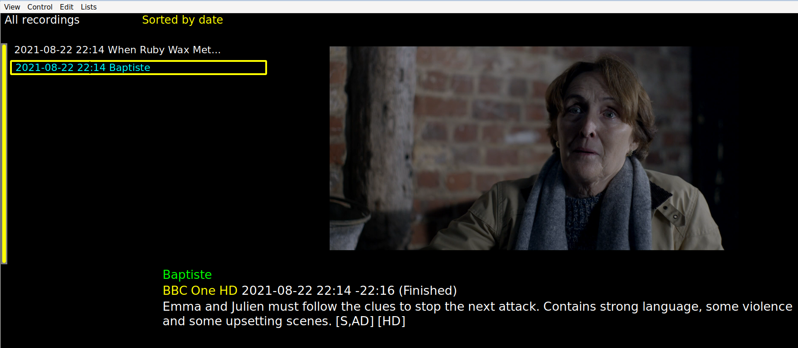

# neumoDVB #

## Viewing and recording TV ##

To actually view channels, you need to swictch to the live mode screen (which is distinghuished by a dark background)
To do so, press `Ctrl-L` if needed. In the live mode screen several displays can be activated

* **Channel Grid mode.**  `View - Channels` or pressing `C` shows a channel/service list, along with live TV preview window

* **Grid EPG mode.** `View - Grid EPG` or pressing `E` shows the grid EPG screen, which may initially be empty until some EPG scanning has been
performed. Also, the preview window is shown

* **Channel EPG mode.** `View - Channel EPG` or pressing `Shift-E` shows the channel EPG screen, which shows all the programs
for the currently selected channel. (This screen still needs to be converted to dark mode.)
performed.

* **Recordings.** `View - Recordings` or pressing `R` shows the list of earlier recorded programs, along with the preview window
performed.

* **View mode.** `View Show/Hide GUI` pr pressing `L` toggles between video only display and the last selectd live mode screen (channels, grid epg...)

* **Channel Screenshot.** `Control Channel Screenshot` pr pressing `Ctrl-J` screenshots the currently playing service
-- without any overlays -- and saves it to /tmp/screenshots. If you don't like the location, change it to something
different in the mpv.conf configuration file.

Usually all of these screens are shown in a window, but for real TV viewing, it is better to enter full screen
mode by pressing `Ctrl-F`.

The following commands are available on these screens:

* `Control - Full Scfeen` (`Ctrl-F`). This will toggle between full-screen and windowed mode.

* `Control - Volume Up` (`=`). This will increase the audio volume for the currently selected live channel.

* `Control - Volume Down` (`-`). This will decrease the audio volume for the currently selected live channel.

* `number` For quick zapping during live mode, type a number. This will move the cursor to the matching channel.

### Channel screen ###

This screen can actually display  services or channels and allows easy switching between channels
and services, restricting these to specific satellites, bouquets or favorite lists
and ordering them alphabetically or numerically.

The example below shows a screenshot.
This screen actually contains five or more distinct regions, which can be navigated between:

* top left (white text in the screenshot): currently selected favorite list; only channels from this list will be shown
  in the channel list

* top middle (yellow text): the current sort order

* left: the channel or service list, selected and ordered according to the top line

* right: the currently playing service(s), also called "live" services.
  There can be multiple live services. In that case, one of the live services will be considered the actvive
  one, which means that it is the one that can be re-tuned, paused ... The current one will be
  will be highlighted in yellow.

* bottom right: information on the currently selected service. Note that the selected service is
  not necessarily the playing one.

To navigate the channel list, use the up and down arrow keys, or page-up and page down.
To move from one screen region to another press `Ctrl-Left`, `Ctrl-Right`, `Ctrl-Up` or `Ctrl-Down`.
This will move the keyboard focus to one of the other regions.

For example, while in the channel list region, the up and down arrow keys will move up and down
in the list, but pressing `Ctrl-Up` will move the cursor to the top line. At this point
You can use the left and right arrow keys (without Ctrl!) to switch between three types of channel/service
lists

* All services

* Services on a specific satellite

* Channels in a specific bouquet or favorite list

In all cases, pressing `Return` will "activate" this choice. In the case you selected "Select Satellite"
or "Select Bouquet", the channel/service list will be replaced temporarily by a list of satellites or bouquets.
Navigate this list using the arrow keys and then press `Return` to confirm your selection.

If you wish to change the sort order, use the arrow keys while holding down the control key to navigate to the
top middle line. The use the left/right arrow keys (without control) to select between sort orders. Finally,
confirm by pressing `Return`.

In the channel list screen region,

* Press `Ctrl-Return` to start viewing the selected channel. If one is already playing, the new channel
  will replace the old one.

* Press `Ctrl-X` to stop playing the channel playing now.

* Press `Ctrl-Shit-Return` to start viewing the selected channel as a second live channel.  This requires multiple
  frontends are available, or services are on the same mux. The active service (by which some keys
  will be interpreted) is shown with a yellow border.
  If one is already playing, the new channel
  will replace the old one.

Remember that other keys are also available to switch between views
* Press `L` to show only video

* Press `E` to show the grid epg

* Press `Ctrl-F` to enter full screen

* Several commands from `View mode` are also available. E.g., Press `Ctrl-O` for onscreen display

### Grid EPG screen ###

neumoDVB performs EPG scanning only when tuned to a service or when tuned to a mux. Services
can be tuned via the dark-mode screens or via the service list. Muxes can be tuned via the DVB-S muxes list.
Currently neumoDVB supports:

* standard DVB EPG

* SkyUK (7 day) and SkyItalia OpenTV EPG

* FreeSat (7 day) and SkyItalia OpenTV EPG

* Movistar+ 7 day EPG

* Viasat Nordic 7 day EPG

* SkyUK and SkyItalia OpenTV EPG

Compared to TVHeadend, several features are not supported:

* No XMLTV epg, but this would be easy to add

* No scheduled EPG scanning

* No series recording, or recording by matching title.

Some of these features may be added later.

In a future version, an EPG an auto-scan feature will be added, which will gather EPG in the background and
can run unattended at night. However, you will find that you don't really need auto-scan in
most cases:

* Some providers (FreeSat, SkyUk, Movistar+) provide 7 or even 14-day EPG. If you view some of
  those channels regularly, chances are that your EPG will be up to date just through this viewing

* For "Freesat" the fastest EPG is on the Freesat home mux, which has no viewable programs. Still
  after scanning this mux, you can tune to the service called "Freesat Home" for a 5 to 10 minutes
  to replenish EPG

* Other providers provide only a few hours worth of EPG or - even worse - only now/next records. In this
  case auto-scan will not help.

So, for now, it is up to the user to tune EPG services from time to time.

The grid epg screen is shown below. You can navigate between programs using the arrow keys.
When the channel list is sorted numerically, you can also enter numeric keys to bring relevant
channels on screen. Other channel lists or sort orders can be selected by navigating to the
corresponding screen area using Ctrl-arrow key combinations.

Many of the commands available in live mode or on the channel screen are also available on the Grid EPG
screen:

* `Ctrl-Return` will tune the active live channel to a new service.

* `Shift-Ctrl-Return` will start a new live service

* `Ctrl-X` will stop the active live service

### View Mode ###

As it's name suggests this mode is for watching TV.
The most useful commands are

* `L` To show the service list or the grid epg (which ever was used last)

* `E` To show the Grid EPG

* `C` To show the service/channel grid.

* `Toggle Overlay` (`Ctrl-O`). This activates the on-screen display, which displays signal levels, and
some program information, but also - at the bottom - some information about the current playback position
when in timeshift mode.

The screenshot below shows the on-screen display.  It displays information about the live channel.
In the example, playback has been paused and therefore the live channel is in "TIMESHIFT" mode.
The navigation bar at the bottom shows the duration of the current
program: it runs from 01:00 to 03:00. It also shows that the program has started only a few minutes
ago: the orange region indicates the available timeshift data. This area will grow over time.

When one of the playing services is focused (as indicated by a yellow border), also some
keys for "trick" play will be enabled:

* Press the left arrow (without control) to jump back one minute in time.

* Press the right arrow (without control) to jump forward one minute in time.

* In a future some more keys will be added which will allow jumping by larger time steps

* Press `Ctrl-Space` to pause/resume the current service

* Some more commands will be added later, e.g, to make it easier to jump over larger time intervals,
  to facilitate channel changing. Probably some options will be added to temporarily display the

When you start a recording on a channel which has an active timeshift buffer, this data will be
included in the recording. Timeshift buffers are discarded when you end playback of a channel.
This is also the case when you  accidentally switch channels. In this case, if the program is important,
you have a few minutes before the disk files of the live buffers are actually discarded. These files
can be converted into a recording relatively easily, but you have to copy them immediately to preserve
them.

### Recording programs ###

Recordings of specific programs can be scheduled or unscheduled on the grid EPG screen.
First navigate to the desired program. Then press, `Ctrl-R`. A dialog box will appear
to confirm the recording. In some cases, some programs may not have an EPG record. In this case, select one of the
grey areas for a specific channel and press `Ctrl-R`.  Last but not least, when a channel is focused (on the left)
instead of an EPG record, `Ctrl-R` will propose to record the currently running program if an EPG record
for it is available, or otherwise a two hour time period, starting from now.

In all cases, a  popup window will appear to allow you to specify the start time and duration of
the recording. Note that NeumoDVB offers only limited options to alter parameters of the recording.

Recordings can also be started from the services screen. In this case, the recording will
be proposed for the currently running program.

### Anonymous recordings ###

'anonymous` recordings` are recordings created without an epg record. Simply select an empty area
in the grid epg and press record, or press record on the services screen when no EPG is present.
Then enter start and end time and a title. Should EPG records overlapping with the recording appear later,
then secondary recordings will be created automatically for each overlapping epg record. This is convenient
for services with only now/next epg, which may arrive after scheduling the
anonymous recording. Anonymous recordings will be shown on the EPG screen, but will be overlayed with
epg records, should these exist. Canceling a secondary epg recording also cancels the anonymous recording.

### Playing recordings ###

To playback recordings, press `R` to activate the recordings screen. An example is shown below.
Press `Ctrl-Return` on any of the recordings to start playback. Press `Ctrl-X` to stop it.
The trick play commands are available as well.

